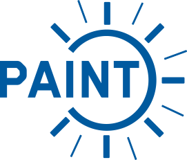

<p align="center">
  <a href="https://paint-database.org" target="_blank">
    
  </a>
</p>

# PAINT

[](https://www.python.org/downloads/)
[](https://github.com/astral-sh/ruff)
[](https://codecov.io/gh/ARTIST-Association/PAINT)
[](https://results.pre-commit.ci/latest/github/ARTIST-Association/PAINT/main)
[](https://opensource.org/licenses/MIT)
[](https://www.bestpractices.dev/projects/10540)
[](https://fair-software.eu)
[](https://paint.readthedocs.io/en/latest/?badge=latest)
[](artist@lists.kit.edu)

## Welcome to ``PAINT``

This repository contains code associated with the [PAINT database](https://paint-database.org). The ``PAINT`` database
makes operational data of concentrating solar power plants available in accordance with the FAIR data principles, i.e.,
making them findable, accessible, interoperable, and reusable. Currently, the data encompasses calibration images,
deflectometry measurements, kinematic settings, and weather information of the concentrating solar power plant in
Jülich, Germany, with the global power plant id (GPPD) WRI1030197. Metadata for all database entries follows the
spatio-temporal asset catalog (STAC) standard.

## What can this repository do for you?

This repository contains two main types of code:
1. **Preprocessing:** This code was used to preprocess the data and extract all metadata into the STAC format. This
preprocessing included moving and renaming files to be in the correct structure, converting coordinates to the WGS84
format, and generating all STAC files (items, collections, and catalogs). This code is found in the subpackage
``paint.preprocessing`` and executed in the scripts located in ``preprocessing-scripts``. This code could be useful if
you have similar data that you would also like to process and include in the ``PAINT`` database!
2. **Data Access and Usage:** This code enables data from the ``PAINT`` database to be easily accessed from a code-base
and applied for a specific use case. Specifically, we provide a ``StacClient`` for browsing the STAC metadata files in
the ``PAINT`` database and downloading specific files. Furthermore, we provide utilities to generate custom benchmarks
for evaluating various calibration algorithms and also a ``torch.Dataset`` for efficiently loading and using calibration
data. This code is found in the subpackage ``paint.data`` and examples of possible execution are found in the
``scripts`` folder.

In the following, we will highlight how to use the code in more detail!

### Installation
We heavily recommend installing the `PAINT` package in a dedicated `Python3.9+` virtual environment. You can
install ``PAINT`` directly from the GitHub repository via:
```bash
pip install git+https://github.com/ARTIST-Association/PAINT
```
Alternatively, you can install ``PAINT`` locally. To achieve this, there are two steps you need to follow:
1. Clone the `PAINT` repository:
   ```bash
   git clone https://github.com/ARTIST-Association/PAINT.git
   ```
2. Install the package from the main branch:
   - Install basic dependencies: ``pip install .``
   - If you want to develop paint, install an editable version with developer dependencies: ``pip install -e ".[dev]"``

### Structure
The ``PAINT`` repository is structured as shown below:
```
.
├── html # Code for the paint-database.org website
├── markers # Saved markers for the WRI1030197 power plant in Jülich
├── paint # Python package
│   ├── data
│   ├── preprocessing
│   └── util
├── plots # Scripts used to generate plots found in our paper
├── preprocessing-scripts # Scripts used for preprocessing and STAC generation
├── scripts # Scripts highlighting example usage of the data
└── test # Tests for the python package
    ├── data
    ├── preprocessing
    └── util
```

### Example usage:
In the ``scripts`` folder there are multiple scripts highlighting how ``PAINT`` can be used. Detailed
descriptions of these scripts are available via our [Documentation](http://paint.readthedocs.io).

## How to contribute
Check out our [contribution guidelines](CONTRIBUTING.md) if you are interested in contributing to the `PAINT` project :fire:.
Please also carefully check our [code of conduct](CODE_OF_CONDUCT.md) :blue_heart:.

## Acknowledgments
This work is supported by the [Helmholtz AI](https://www.helmholtz.ai/) platform grant.

-----------
<div align="center">
  <a href="https://www.dlr.de/EN/Home/home_node.html"></a>
  <a href="http://www.kit.edu/english/index.php"></a>
  <a href="https://synhelion.com/"></a>
  <a href="https://www.helmholtz.ai/"></a>
</div>
